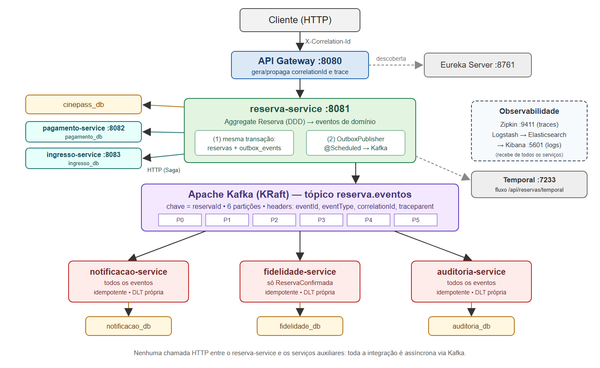

# Arquitetura orientada a eventos do CinePass

## Serviços e responsabilidades

| Serviço | Responsabilidade | Banco | Porta |
|---|---|---|---|
| `discovery-server` | Registro e descoberta (Eureka) | — | 8761 |
| `api-gateway` | Entrada HTTP; gera/propaga `X-Correlation-Id`; início do trace | — | 8080 |
| `reserva-service` | Catálogo, sessões, assentos e o Aggregate `Reserva`; **produtor** dos eventos (Outbox) | `cinepass_db` | 8081 |
| `pagamento-service` | Cobrança e estorno (participante da Saga) | `pagamento_db` | 8082 |
| `ingresso-service` | Emissão e cancelamento de ingressos (participante da Saga) | `ingresso_db` | 8083 |
| `notificacao-service` | Consome todos os eventos e registra notificações ao cliente | `notificacao_db` | 8084 |
| `fidelidade-service` | Consome `ReservaConfirmada` e mantém o histórico e os pontos do cliente | `fidelidade_db` | 8085 |
| `auditoria-service` | Consome todos os eventos e mantém a trilha de auditoria | `auditoria_db` | 8086 |

Cada serviço tem seu banco e nenhum acessa o banco de outro. Os três serviços
auxiliares (notificação, fidelidade e auditoria) recebem as informações apenas
por eventos: o `reserva-service` não faz nenhuma chamada HTTP para eles.

O `pagamento-service` e o `ingresso-service` continuam sendo chamados pelo
`reserva-service` (HTTP síncrono no fluxo `POST /api/reservas` e activities
Temporal no fluxo `POST /api/reservas/temporal`). Eles são os passos da Saga da
reserva, tema das outras etapas do CinePass, e não serviços auxiliares.

## Como a atividade foi aplicada ao CinePass

| Enunciado (Freela Marketplace) | CinePass |
|---|---|
| `contrato-service` e o Aggregate Contrato | `reserva-service` e o Aggregate `Reserva` |
| `ContratoCriado → EntregaRegistrada → ContratoConcluido` | `ReservaCriada → ReservaPagamentoAprovado → ReservaConfirmada` (+ `ReservaCancelada`) |
| chave `contratoId` | chave `reservaId` |
| `notificacao-service` | `notificacao-service` |
| `reputacao-service` (histórico do freelancer) | `fidelidade-service` (histórico e pontos do cliente) |
| `auditoria-service` | `auditoria-service` |

## Por que Outbox + partição por chave + consumidor idempotente

1. **Transactional Outbox**: o evento é gravado atomicamente com a reserva, então não existe reserva sem evento nem evento sem reserva.
2. **Partição por `reservaId`**: a ordem de leitura é a ordem de escrita para cada reserva, mesmo com vários consumidores em paralelo.
3. **Consumidor idempotente**: a entrega *at-least-once* nunca vira efeito duplicado.

Nenhum dos três resolve o problema sozinho: juntos, entregam cada efeito de
negócio uma única vez, na ordem certa.

## Documentação relacionada

- [`EVENTS.md`](EVENTS.md): tópicos, eventos, payloads, chaves e exemplos.
- [`OBSERVABILIDADE.md`](OBSERVABILIDADE.md): logs, ELK, correlação, Zipkin.
- [`EVIDENCIAS.md`](EVIDENCIAS.md): evidências de execução.
