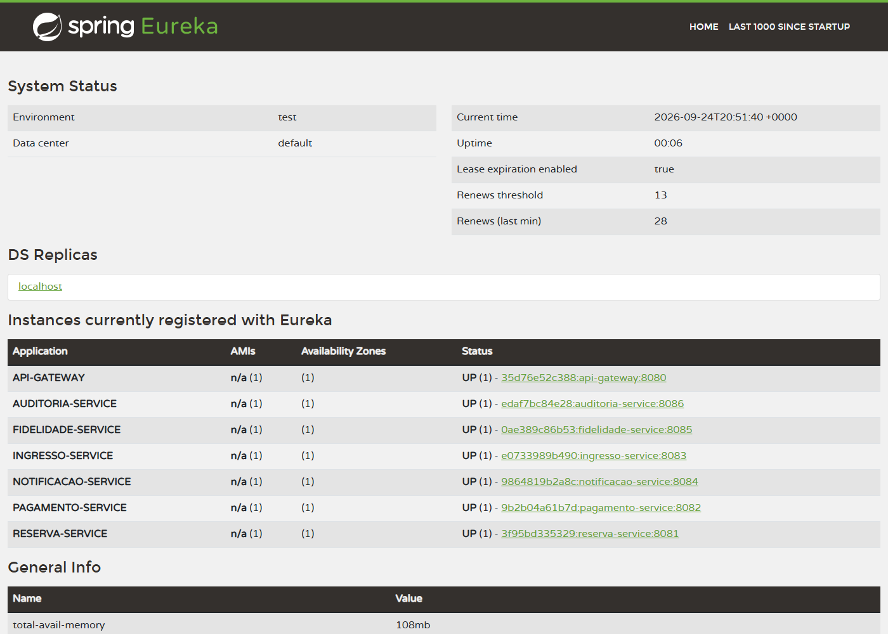
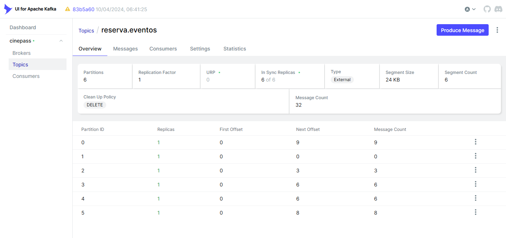
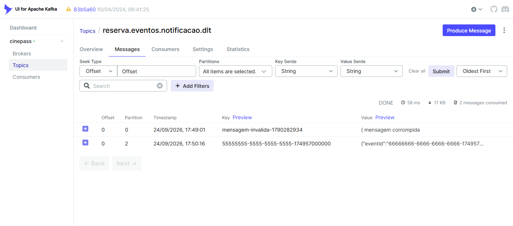
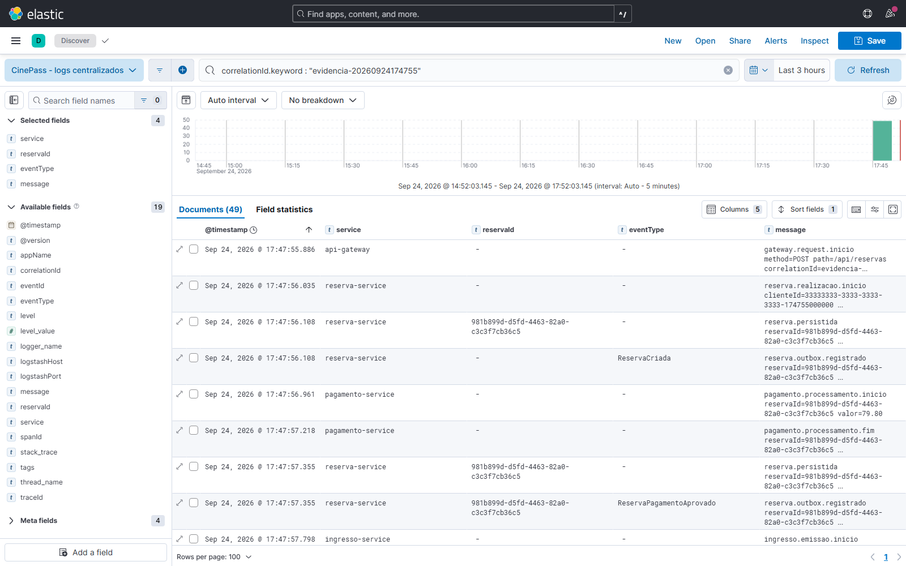
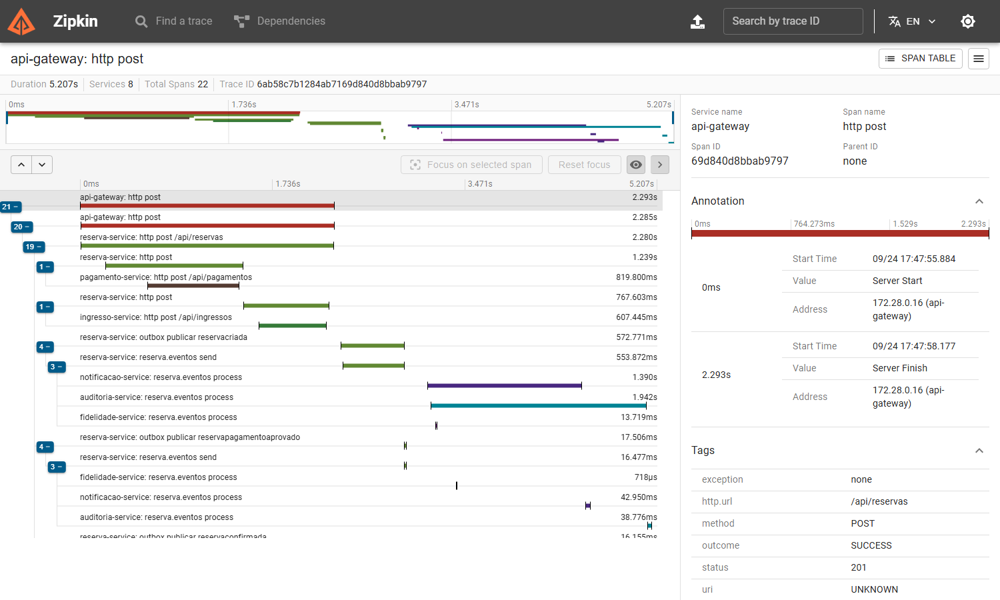
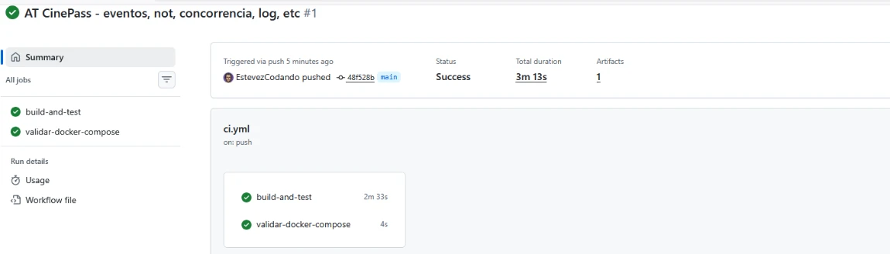

# Evidências de execução

Evidências coletadas com o ambiente completo em execução, recriado do zero
(`docker compose down -v` e `docker compose up --build -d`, na raiz do
projeto). Todas as saídas em texto foram geradas pelo script
**`infra/scripts/coletar-evidencias.sh`**, que pode ser executado de novo a
qualquer momento (em um ambiente recém-criado, porque os cenários usam assentos
fixos da sessão de exemplo). As saídas completas ficam em
[`docs/evidencias/`](evidencias/); abaixo estão as mesmas saídas, com uma
explicação de cada cenário.

Operação usada como fio condutor:

```text
correlationId = evidencia-20260924174755
reservaId     = 981b899d-d5fd-4463-82a0-c3c3f7cb36c5
traceId       = 6ab58c7b1284ab7169d840d8bbab9797
```

Arquitetura: [`ARQUITETURA.md`](ARQUITETURA.md) · Eventos: [`EVENTS.md`](EVENTS.md) · Observabilidade: [`OBSERVABILIDADE.md`](OBSERVABILIDADE.md)



## 0. Ambiente

Os containers do `docker-compose.yml` no ar e os 7 serviços registrados no Eureka.

```text
NAMES                    STATUS
cinepass-gateway         Up About a minute
cinepass-temporal-ui     Up 2 minutes
cinepass-reserva         Up About a minute
cinepass-fidelidade      Up About a minute
cinepass-auditoria       Up About a minute
cinepass-notificacao     Up About a minute
cinepass-temporal        Up 2 minutes
cinepass-ingresso        Up 2 minutes
cinepass-pagamento       Up 2 minutes
cinepass-logstash        Up About a minute
cinepass-kafka-ui        Up 2 minutes
cinepass-kibana          Up About a minute
cinepass-postgres        Up 2 minutes (healthy)
cinepass-kafka           Up 2 minutes (healthy)
cinepass-discovery       Up 2 minutes
cinepass-elasticsearch   Up 2 minutes (healthy)
cinepass-zipkin          Up 2 minutes (healthy)

"name":"API-GATEWAY"
"name":"AUDITORIA-SERVICE"
"name":"FIDELIDADE-SERVICE"
"name":"INGRESSO-SERVICE"
"name":"NOTIFICACAO-SERVICE"
"name":"PAGAMENTO-SERVICE"
"name":"RESERVA-SERVICE"
```

## 1. Requisição recebida pelo API Gateway

Reserva dos assentos A1 e A2 pelo Gateway (`:8080`), com `X-Correlation-Id` informado pelo cliente. O Gateway devolve o mesmo identificador na resposta e registra o início e o fim da requisição com o `traceId`. A reserva termina `CONFIRMADA` (fluxo síncrono: pagamento e ingresso chamados por HTTP).

```text
$ curl -i -X POST http://localhost:8080/api/reservas -H 'X-Correlation-Id: evidencia-20260924174755' -d '{... "assentos":["A1","A2"] ...}'
HTTP/1.1 201 Created
Content-Type: application/json
Content-Length: 366
Date: Thu, 24 Sep 2026 20:47:58 GMT
X-Correlation-Id: evidencia-20260924174755

{"reservaId":"981b899d-d5fd-4463-82a0-c3c3f7cb36c5","clienteId":"33333333-3333-3333-3333-174755000000","sessaoId":"22222222-2222-2222-2222-222222222222","assentos":["A1","A2"],"valorTotal":79.80,"status":"CONFIRMADA","pagamentoId":"afc20801-3886-4eef-822a-cc88b0de52b6","ingressoId":"d73c806d-86df-4d51-b0c5-64b8bd04d923","criadaEm":"2026-09-24T20:47:56.063252203Z"}

--- logs do api-gateway para este correlationId ---
2026-09-24 20:47:55.886 INFO  service=api-gateway traceId=6ab58c7b1284ab7169d840d8bbab9797 spanId=69d840d8bbab9797 correlationId= thread=reactor-http-epoll-2 logger=b.c.c.g.CorrelationIdGatewayFilter - gateway.request.inicio method=POST path=/api/reservas correlationId=evidencia-20260924174755
2026-09-24 20:47:58.178 INFO  service=api-gateway traceId=6ab58c7b1284ab7169d840d8bbab9797 spanId=69d840d8bbab9797 correlationId= thread=reactor-http-epoll-2 logger=b.c.c.g.CorrelationIdGatewayFilter - gateway.request.fim method=POST path=/api/reservas status=201 CREATED durationMs=2292 correlationId=evidencia-20260924174755
```

## 2. Alteração persistida no reserva-service (e consistência no rollback)

A reserva foi gravada no `cinepass_db` e os três eventos de domínio foram gravados em `outbox_events` **na mesma transação** e depois publicados (`PUBLICADO`, com `published_at`). O cenário 2b faz uma reserva com `simularFalhaIngresso=true`: a transação local faz rollback e, junto com a reserva, somem os eventos da outbox. Nenhum consumidor é avisado de uma reserva que não existe.

```text
                  id                  |   status   | valor_total |             pagamento_id             |             ingresso_id              |           criada_em
--------------------------------------+------------+-------------+--------------------------------------+--------------------------------------+-------------------------------
 981b899d-d5fd-4463-82a0-c3c3f7cb36c5 | CONFIRMADA |       79.80 | afc20801-3886-4eef-822a-cc88b0de52b6 | d73c806d-86df-4d51-b0c5-64b8bd04d923 | 2026-09-24 20:47:56.063252+00
(1 row)

--- outbox: eventos gravados na mesma transação da reserva e depois publicados ---
        event_type        |  status   |          created_at           |         published_at          |      correlation_id
--------------------------+-----------+-------------------------------+-------------------------------+--------------------------
 ReservaCriada            | PUBLICADO | 2026-09-24 20:47:56.104106+00 | 2026-09-24 20:47:58.807726+00 | evidencia-20260924174755
 ReservaPagamentoAprovado | PUBLICADO | 2026-09-24 20:47:57.35266+00  | 2026-09-24 20:47:58.825862+00 | evidencia-20260924174755
 ReservaConfirmada        | PUBLICADO | 2026-09-24 20:47:58.128027+00 | 2026-09-24 20:47:58.841772+00 | evidencia-20260924174755
(3 rows)

--- logs do reserva-service ---
2026-09-24 20:47:56.108 INFO  service=reserva-service traceId=6ab58c7b1284ab7169d840d8bbab9797 spanId=03e20403b2773d8a correlationId=evidencia-20260924174755 reservaId= thread=http-nio-8081-exec-2 logger=b.c.c.r.i.outbox.OutboxEventWriter - reserva.outbox.registrado reservaId=981b899d-d5fd-4463-82a0-c3c3f7cb36c5 eventId=bb7ceca0-dace-4ab3-badc-fda21a33bb99 eventType=ReservaCriada correlationId=evidencia-20260924174755
2026-09-24 20:47:56.108 INFO  service=reserva-service traceId=6ab58c7b1284ab7169d840d8bbab9797 spanId=03e20403b2773d8a correlationId=evidencia-20260924174755 reservaId=981b899d-d5fd-4463-82a0-c3c3f7cb36c5 thread=http-nio-8081-exec-2 logger=b.c.c.r.a.ReservaApplicationService - reserva.persistida reservaId=981b899d-d5fd-4463-82a0-c3c3f7cb36c5 status=AGUARDANDO_PAGAMENTO eventos=1
2026-09-24 20:47:57.355 INFO  service=reserva-service traceId=6ab58c7b1284ab7169d840d8bbab9797 spanId=03e20403b2773d8a correlationId=evidencia-20260924174755 reservaId=981b899d-d5fd-4463-82a0-c3c3f7cb36c5 thread=http-nio-8081-exec-2 logger=b.c.c.r.i.outbox.OutboxEventWriter - reserva.outbox.registrado reservaId=981b899d-d5fd-4463-82a0-c3c3f7cb36c5 eventId=5cf2232f-2c8a-49fa-ba21-a33c220bcd7b eventType=ReservaPagamentoAprovado correlationId=evidencia-20260924174755
2026-09-24 20:47:57.355 INFO  service=reserva-service traceId=6ab58c7b1284ab7169d840d8bbab9797 spanId=03e20403b2773d8a correlationId=evidencia-20260924174755 reservaId=981b899d-d5fd-4463-82a0-c3c3f7cb36c5 thread=http-nio-8081-exec-2 logger=b.c.c.r.a.ReservaApplicationService - reserva.persistida reservaId=981b899d-d5fd-4463-82a0-c3c3f7cb36c5 status=EMITINDO_INGRESSO eventos=1
2026-09-24 20:47:58.130 INFO  service=reserva-service traceId=6ab58c7b1284ab7169d840d8bbab9797 spanId=03e20403b2773d8a correlationId=evidencia-20260924174755 reservaId=981b899d-d5fd-4463-82a0-c3c3f7cb36c5 thread=http-nio-8081-exec-2 logger=b.c.c.r.i.outbox.OutboxEventWriter - reserva.outbox.registrado reservaId=981b899d-d5fd-4463-82a0-c3c3f7cb36c5 eventId=8a15c551-4b3c-42c9-a4b6-040a97e90d7e eventType=ReservaConfirmada correlationId=evidencia-20260924174755
2026-09-24 20:47:58.130 INFO  service=reserva-service traceId=6ab58c7b1284ab7169d840d8bbab9797 spanId=03e20403b2773d8a correlationId=evidencia-20260924174755 reservaId=981b899d-d5fd-4463-82a0-c3c3f7cb36c5 thread=http-nio-8081-exec-2 logger=b.c.c.r.a.ReservaApplicationService - reserva.persistida reservaId=981b899d-d5fd-4463-82a0-c3c3f7cb36c5 status=CONFIRMADA eventos=1
2026-09-24 20:47:58.131 INFO  service=reserva-service traceId=6ab58c7b1284ab7169d840d8bbab9797 spanId=03e20403b2773d8a correlationId=evidencia-20260924174755 reservaId=981b899d-d5fd-4463-82a0-c3c3f7cb36c5 thread=http-nio-8081-exec-2 logger=b.c.c.r.a.ReservaApplicationService - reserva.realizacao.sucesso reservaId=981b899d-d5fd-4463-82a0-c3c3f7cb36c5 status=CONFIRMADA pagamentoId=afc20801-3886-4eef-822a-cc88b0de52b6 ingressoId=d73c806d-86df-4d51-b0c5-64b8bd04d923

==================================================================
2b. CONSISTÊNCIA: reserva que falha na emissão do ingresso não deixa evento na outbox
==================================================================
HTTP/1.1 500 Internal Server Error
{"detail":"O pagamento foi aprovado, mas a emissão do ingresso falhou. A transação local será revertida, porém o pagamento remoto continuará confirmado.","instance":"/api/reservas","status":500,"title":"Inconsistência distribuída proposital","reservaId":"144929b1-d903-4b12-afaf-7ad7b7043587","pagamentoId":"d11637fa-d3bd-4b30-9f89-a0f5d5dadb2e","proximoPassoDaAula":"Implementar compensação com Saga Pattern"}

 reservas_com_esse_id
----------------------
                    0
(1 row)

 eventos_na_outbox
-------------------
                 0
(1 row)
```

## 3. Eventos publicados no Apache Kafka

O `OutboxPublisher` publicou os três eventos no tópico `reserva.eventos` com a chave `reservaId`: mesma partição, offsets crescentes. As mensagens lidas do tópico mostram os headers `eventId`, `eventType`, `correlationId` e `traceparent`.

```text
2026-09-24 20:47:58.807 INFO  service=reserva-service traceId=6ab58c7b1284ab7169d840d8bbab9797 spanId=8bd7185633c0f597 correlationId=evidencia-20260924174755 reservaId=981b899d-d5fd-4463-82a0-c3c3f7cb36c5 thread=scheduling-1 logger=b.c.c.r.i.outbox.OutboxPublisher - reserva.outbox.publicado reservaId=981b899d-d5fd-4463-82a0-c3c3f7cb36c5 eventId=bb7ceca0-dace-4ab3-badc-fda21a33bb99 eventType=ReservaCriada topic=reserva.eventos partition=0 offset=0
2026-09-24 20:47:58.825 INFO  service=reserva-service traceId=6ab58c7b1284ab7169d840d8bbab9797 spanId=5e517f83f2015217 correlationId=evidencia-20260924174755 reservaId=981b899d-d5fd-4463-82a0-c3c3f7cb36c5 thread=scheduling-1 logger=b.c.c.r.i.outbox.OutboxPublisher - reserva.outbox.publicado reservaId=981b899d-d5fd-4463-82a0-c3c3f7cb36c5 eventId=5cf2232f-2c8a-49fa-ba21-a33c220bcd7b eventType=ReservaPagamentoAprovado topic=reserva.eventos partition=0 offset=1
2026-09-24 20:47:58.841 INFO  service=reserva-service traceId=6ab58c7b1284ab7169d840d8bbab9797 spanId=ac377eab5a4c5ad3 correlationId=evidencia-20260924174755 reservaId=981b899d-d5fd-4463-82a0-c3c3f7cb36c5 thread=scheduling-1 logger=b.c.c.r.i.outbox.OutboxPublisher - reserva.outbox.publicado reservaId=981b899d-d5fd-4463-82a0-c3c3f7cb36c5 eventId=8a15c551-4b3c-42c9-a4b6-040a97e90d7e eventType=ReservaConfirmada topic=reserva.eventos partition=0 offset=2

--- mensagens lidas do tópico (partição, offset, headers, chave, valor) ---
Partition:0	Offset:0	eventId:bb7ceca0-dace-4ab3-badc-fda21a33bb99,eventType:ReservaCriada,correlationId:evidencia-20260924174755,traceparent:00-6ab58c7b1284ab7169d840d8bbab9797-2ac06608d1d94bb2-01	981b899d-d5fd-4463-82a0-c3c3f7cb36c5	{"eventId":"bb7ceca0-dace-4ab3-badc-fda21a33bb99","eventType":"ReservaCriada","eventVersion":1,"occurredAt":"2026-09-24T20:47:56.063810650Z","reservaId":"981b899d-d5fd-4463-82a0-c3c3f7cb36c5","correlationId":"evidencia-20260924174755","producer":"reserva-service","data":{"reservaId":"981b899d-d5fd-4463-82a0-c3c3f7cb36c5","clienteId":"33333333-3333-3333-3333-174755000000","sessaoId":"22222222-2222-2222-2222-222222222222","assentos":["A1","A2"],"valorTotal":79.80,"status":"AGUARDANDO_PAGAMENTO"}}
Partition:0	Offset:1	eventId:5cf2232f-2c8a-49fa-ba21-a33c220bcd7b,eventType:ReservaPagamentoAprovado,correlationId:evidencia-20260924174755,traceparent:00-6ab58c7b1284ab7169d840d8bbab9797-1af69ddf461ce9b8-01	981b899d-d5fd-4463-82a0-c3c3f7cb36c5	{"eventId":"5cf2232f-2c8a-49fa-ba21-a33c220bcd7b","eventType":"ReservaPagamentoAprovado","eventVersion":1,"occurredAt":"2026-09-24T20:47:57.349800928Z","reservaId":"981b899d-d5fd-4463-82a0-c3c3f7cb36c5","correlationId":"evidencia-20260924174755","producer":"reserva-service","data":{"reservaId":"981b899d-d5fd-4463-82a0-c3c3f7cb36c5","clienteId":"33333333-3333-3333-3333-174755000000","pagamentoId":"afc20801-3886-4eef-822a-cc88b0de52b6","valorTotal":79.80,"status":"PAGAMENTO_APROVADO"}}
Partition:0	Offset:2	eventId:8a15c551-4b3c-42c9-a4b6-040a97e90d7e,eventType:ReservaConfirmada,correlationId:evidencia-20260924174755,traceparent:00-6ab58c7b1284ab7169d840d8bbab9797-f6ab0a75f2536b47-01	981b899d-d5fd-4463-82a0-c3c3f7cb36c5	{"eventId":"8a15c551-4b3c-42c9-a4b6-040a97e90d7e","eventType":"ReservaConfirmada","eventVersion":1,"occurredAt":"2026-09-24T20:47:58.125322526Z","reservaId":"981b899d-d5fd-4463-82a0-c3c3f7cb36c5","correlationId":"evidencia-20260924174755","producer":"reserva-service","data":{"reservaId":"981b899d-d5fd-4463-82a0-c3c3f7cb36c5","clienteId":"33333333-3333-3333-3333-174755000000","sessaoId":"22222222-2222-2222-2222-222222222222","assentos":["A1","A2"],"valorTotal":79.80,"pagamentoId":"afc20801-3886-4eef-822a-cc88b0de52b6","ingressoId":"d73c806d-86df-4d51-b0c5-64b8bd04d923","status":"CONFIRMADA"}}
```



## 4. Consumo pelos serviços interessados

`notificacao-service` e `auditoria-service` processaram os três eventos, na ordem. O `fidelidade-service` recebeu só o `ReservaConfirmada` (o filtro por `eventType` descarta os outros tipos antes do listener). As linhas da notificação identificam o evento recebido, a reserva (`reservaId`), o destinatário (`destinatarioId`) e o resultado (`resultado=notificacao_registrada`).

```text
--- notificacao-service ---
2026-09-24 20:47:59.183 INFO  service=notificacao-service traceId=6ab58c7b1284ab7169d840d8bbab9797 spanId=95da3584bf1b19fb correlationId=evidencia-20260924174755 reservaId=981b899d-d5fd-4463-82a0-c3c3f7cb36c5 eventId=bb7ceca0-dace-4ab3-badc-fda21a33bb99 thread=org.springframework.kafka.KafkaListenerEndpointContainer#0-0-C-1 logger=b.c.c.n.i.m.ReservaEventListener - kafka.evento.recebido service=notificacao-service partition=0 offset=0 key=981b899d-d5fd-4463-82a0-c3c3f7cb36c5 eventId=bb7ceca0-dace-4ab3-badc-fda21a33bb99 eventType=ReservaCriada reservaId=981b899d-d5fd-4463-82a0-c3c3f7cb36c5 correlationId=evidencia-20260924174755
2026-09-24 20:48:00.312 INFO  service=notificacao-service traceId=6ab58c7b1284ab7169d840d8bbab9797 spanId=95da3584bf1b19fb correlationId=evidencia-20260924174755 reservaId=981b899d-d5fd-4463-82a0-c3c3f7cb36c5 eventId=bb7ceca0-dace-4ab3-badc-fda21a33bb99 thread=org.springframework.kafka.KafkaListenerEndpointContainer#0-0-C-1 logger=b.c.c.n.a.NotificacaoApplicationService - notificacao.evento.processado.sucesso eventId=bb7ceca0-dace-4ab3-badc-fda21a33bb99 eventType=ReservaCriada reservaId=981b899d-d5fd-4463-82a0-c3c3f7cb36c5 destinatarioId=33333333-3333-3333-3333-174755000000 notificacaoId=8433c2d1-95a4-4ffb-8d58-169f34e31b1e resultado=notificacao_registrada
2026-09-24 20:48:00.441 INFO  service=notificacao-service traceId=6ab58c7b1284ab7169d840d8bbab9797 spanId=6efc07b158d4eb10 correlationId=evidencia-20260924174755 reservaId=981b899d-d5fd-4463-82a0-c3c3f7cb36c5 eventId=5cf2232f-2c8a-49fa-ba21-a33c220bcd7b thread=org.springframework.kafka.KafkaListenerEndpointContainer#0-0-C-1 logger=b.c.c.n.i.m.ReservaEventListener - kafka.evento.recebido service=notificacao-service partition=0 offset=1 key=981b899d-d5fd-4463-82a0-c3c3f7cb36c5 eventId=5cf2232f-2c8a-49fa-ba21-a33c220bcd7b eventType=ReservaPagamentoAprovado reservaId=981b899d-d5fd-4463-82a0-c3c3f7cb36c5 correlationId=evidencia-20260924174755
2026-09-24 20:48:00.470 INFO  service=notificacao-service traceId=6ab58c7b1284ab7169d840d8bbab9797 spanId=6efc07b158d4eb10 correlationId=evidencia-20260924174755 reservaId=981b899d-d5fd-4463-82a0-c3c3f7cb36c5 eventId=5cf2232f-2c8a-49fa-ba21-a33c220bcd7b thread=org.springframework.kafka.KafkaListenerEndpointContainer#0-0-C-1 logger=b.c.c.n.a.NotificacaoApplicationService - notificacao.evento.processado.sucesso eventId=5cf2232f-2c8a-49fa-ba21-a33c220bcd7b eventType=ReservaPagamentoAprovado reservaId=981b899d-d5fd-4463-82a0-c3c3f7cb36c5 destinatarioId=33333333-3333-3333-3333-174755000000 notificacaoId=ffc24c93-56d8-40bc-ae78-78446fab56cd resultado=notificacao_registrada
2026-09-24 20:48:00.496 INFO  service=notificacao-service traceId=6ab58c7b1284ab7169d840d8bbab9797 spanId=ce0cf54226c08c99 correlationId=evidencia-20260924174755 reservaId=981b899d-d5fd-4463-82a0-c3c3f7cb36c5 eventId=8a15c551-4b3c-42c9-a4b6-040a97e90d7e thread=org.springframework.kafka.KafkaListenerEndpointContainer#0-0-C-1 logger=b.c.c.n.i.m.ReservaEventListener - kafka.evento.recebido service=notificacao-service partition=0 offset=2 key=981b899d-d5fd-4463-82a0-c3c3f7cb36c5 eventId=8a15c551-4b3c-42c9-a4b6-040a97e90d7e eventType=ReservaConfirmada reservaId=981b899d-d5fd-4463-82a0-c3c3f7cb36c5 correlationId=evidencia-20260924174755
2026-09-24 20:48:00.532 INFO  service=notificacao-service traceId=6ab58c7b1284ab7169d840d8bbab9797 spanId=ce0cf54226c08c99 correlationId=evidencia-20260924174755 reservaId=981b899d-d5fd-4463-82a0-c3c3f7cb36c5 eventId=8a15c551-4b3c-42c9-a4b6-040a97e90d7e thread=org.springframework.kafka.KafkaListenerEndpointContainer#0-0-C-1 logger=b.c.c.n.a.NotificacaoApplicationService - notificacao.evento.processado.sucesso eventId=8a15c551-4b3c-42c9-a4b6-040a97e90d7e eventType=ReservaConfirmada reservaId=981b899d-d5fd-4463-82a0-c3c3f7cb36c5 destinatarioId=33333333-3333-3333-3333-174755000000 notificacaoId=ea813ed5-5c53-4388-b65e-5ef5c7037dad resultado=notificacao_registrada
--- fidelidade-service ---
2026-09-24 20:47:59.458 INFO  service=fidelidade-service traceId=6ab58c7b1284ab7169d840d8bbab9797 spanId=f517d5cbe2ac2de5 correlationId=evidencia-20260924174755 reservaId=981b899d-d5fd-4463-82a0-c3c3f7cb36c5 eventId=8a15c551-4b3c-42c9-a4b6-040a97e90d7e thread=org.springframework.kafka.KafkaListenerEndpointContainer#0-0-C-1 logger=b.c.c.f.i.m.ReservaEventListener - kafka.evento.recebido service=fidelidade-service partition=0 offset=2 key=981b899d-d5fd-4463-82a0-c3c3f7cb36c5 eventId=8a15c551-4b3c-42c9-a4b6-040a97e90d7e eventType=ReservaConfirmada reservaId=981b899d-d5fd-4463-82a0-c3c3f7cb36c5 correlationId=evidencia-20260924174755
2026-09-24 20:48:00.591 INFO  service=fidelidade-service traceId=6ab58c7b1284ab7169d840d8bbab9797 spanId=f517d5cbe2ac2de5 correlationId=evidencia-20260924174755 reservaId=981b899d-d5fd-4463-82a0-c3c3f7cb36c5 eventId=8a15c551-4b3c-42c9-a4b6-040a97e90d7e thread=org.springframework.kafka.KafkaListenerEndpointContainer#0-0-C-1 logger=b.c.c.f.a.FidelidadeApplicationService - fidelidade.evento.processado.sucesso eventId=8a15c551-4b3c-42c9-a4b6-040a97e90d7e reservaId=981b899d-d5fd-4463-82a0-c3c3f7cb36c5 clienteId=33333333-3333-3333-3333-174755000000 reservasConfirmadas=1 pontos=79 resultado=historico_atualizado
--- auditoria-service ---
2026-09-24 20:47:59.345 INFO  service=auditoria-service traceId=6ab58c7b1284ab7169d840d8bbab9797 spanId=ce6101d7d117852a correlationId=evidencia-20260924174755 reservaId=981b899d-d5fd-4463-82a0-c3c3f7cb36c5 eventId=bb7ceca0-dace-4ab3-badc-fda21a33bb99 thread=org.springframework.kafka.KafkaListenerEndpointContainer#0-0-C-1 logger=b.c.c.a.i.m.ReservaEventListener - kafka.evento.recebido service=auditoria-service partition=0 offset=0 key=981b899d-d5fd-4463-82a0-c3c3f7cb36c5 eventId=bb7ceca0-dace-4ab3-badc-fda21a33bb99 eventType=ReservaCriada reservaId=981b899d-d5fd-4463-82a0-c3c3f7cb36c5 correlationId=evidencia-20260924174755
2026-09-24 20:48:00.932 INFO  service=auditoria-service traceId=6ab58c7b1284ab7169d840d8bbab9797 spanId=ce6101d7d117852a correlationId=evidencia-20260924174755 reservaId=981b899d-d5fd-4463-82a0-c3c3f7cb36c5 eventId=bb7ceca0-dace-4ab3-badc-fda21a33bb99 thread=org.springframework.kafka.KafkaListenerEndpointContainer#0-0-C-1 logger=b.c.c.a.a.AuditoriaApplicationService - auditoria.evento.processado.sucesso auditoriaId=82e25091-d458-489d-871c-714f3ff28f00 eventId=bb7ceca0-dace-4ab3-badc-fda21a33bb99 eventType=ReservaCriada reservaId=981b899d-d5fd-4463-82a0-c3c3f7cb36c5 particao=0 offset=0 resultado=auditoria_registrada
2026-09-24 20:48:01.001 INFO  service=auditoria-service traceId=6ab58c7b1284ab7169d840d8bbab9797 spanId=db0e49bfe4577ff0 correlationId=evidencia-20260924174755 reservaId=981b899d-d5fd-4463-82a0-c3c3f7cb36c5 eventId=5cf2232f-2c8a-49fa-ba21-a33c220bcd7b thread=org.springframework.kafka.KafkaListenerEndpointContainer#0-0-C-1 logger=b.c.c.a.i.m.ReservaEventListener - kafka.evento.recebido service=auditoria-service partition=0 offset=1 key=981b899d-d5fd-4463-82a0-c3c3f7cb36c5 eventId=5cf2232f-2c8a-49fa-ba21-a33c220bcd7b eventType=ReservaPagamentoAprovado reservaId=981b899d-d5fd-4463-82a0-c3c3f7cb36c5 correlationId=evidencia-20260924174755
2026-09-24 20:48:01.025 INFO  service=auditoria-service traceId=6ab58c7b1284ab7169d840d8bbab9797 spanId=db0e49bfe4577ff0 correlationId=evidencia-20260924174755 reservaId=981b899d-d5fd-4463-82a0-c3c3f7cb36c5 eventId=5cf2232f-2c8a-49fa-ba21-a33c220bcd7b thread=org.springframework.kafka.KafkaListenerEndpointContainer#0-0-C-1 logger=b.c.c.a.a.AuditoriaApplicationService - auditoria.evento.processado.sucesso auditoriaId=46246dfc-49c4-489a-8c2c-198976c00dea eventId=5cf2232f-2c8a-49fa-ba21-a33c220bcd7b eventType=ReservaPagamentoAprovado reservaId=981b899d-d5fd-4463-82a0-c3c3f7cb36c5 particao=0 offset=1 resultado=auditoria_registrada
2026-09-24 20:48:01.052 INFO  service=auditoria-service traceId=6ab58c7b1284ab7169d840d8bbab9797 spanId=098a03ad0f68ce03 correlationId=evidencia-20260924174755 reservaId=981b899d-d5fd-4463-82a0-c3c3f7cb36c5 eventId=8a15c551-4b3c-42c9-a4b6-040a97e90d7e thread=org.springframework.kafka.KafkaListenerEndpointContainer#0-0-C-1 logger=b.c.c.a.i.m.ReservaEventListener - kafka.evento.recebido service=auditoria-service partition=0 offset=2 key=981b899d-d5fd-4463-82a0-c3c3f7cb36c5 eventId=8a15c551-4b3c-42c9-a4b6-040a97e90d7e eventType=ReservaConfirmada reservaId=981b899d-d5fd-4463-82a0-c3c3f7cb36c5 correlationId=evidencia-20260924174755
2026-09-24 20:48:01.063 INFO  service=auditoria-service traceId=6ab58c7b1284ab7169d840d8bbab9797 spanId=098a03ad0f68ce03 correlationId=evidencia-20260924174755 reservaId=981b899d-d5fd-4463-82a0-c3c3f7cb36c5 eventId=8a15c551-4b3c-42c9-a4b6-040a97e90d7e thread=org.springframework.kafka.KafkaListenerEndpointContainer#0-0-C-1 logger=b.c.c.a.a.AuditoriaApplicationService - auditoria.evento.processado.sucesso auditoriaId=8a021d71-e452-41e2-b639-1ef8b1aa8abf eventId=8a15c551-4b3c-42c9-a4b6-040a97e90d7e eventType=ReservaConfirmada reservaId=981b899d-d5fd-4463-82a0-c3c3f7cb36c5 particao=0 offset=2 resultado=auditoria_registrada

(fidelidade-service só recebe ReservaConfirmada: os demais tipos são descartados pelo filtro por eventType)
```

## 5. Persistência nos serviços consumidores

Cada consumidor gravou o resultado no seu próprio banco: três notificações, o histórico de fidelidade do cliente (1 reserva, 2 ingressos, R$ 79,80, 79 pontos) e a trilha de auditoria com partição e offset. No fim, a consulta posterior da auditoria pela API (`GET /api/auditoria/reserva/{reservaId}`) devolve, para cada evento, o identificador, o tipo, a reserva, a data e hora, o `correlationId` e o conteúdo completo da mensagem.

```text
--- notificacao_db ---
        tipo        |           destinatario_id            |                                mensagem                                 |           criada_em
--------------------+--------------------------------------+-------------------------------------------------------------------------+-------------------------------
 RESERVA_CRIADA     | 33333333-3333-3333-3333-174755000000 | Recebemos sua reserva dos assentos [A1, A2]. Aguardando o pagamento.    | 2026-09-24 20:48:00.229807+00
 PAGAMENTO_APROVADO | 33333333-3333-3333-3333-174755000000 | O pagamento de R$ 79.80 foi aprovado. Estamos emitindo seu ingresso.    | 2026-09-24 20:48:00.450378+00
 RESERVA_CONFIRMADA | 33333333-3333-3333-3333-174755000000 | Reserva confirmada! Seu ingresso para os assentos [A1, A2] foi emitido. | 2026-09-24 20:48:00.510891+00
(3 rows)

--- fidelidade_db ---
              cliente_id              | reservas_confirmadas | ingressos_comprados | valor_total_gasto | pontos
--------------------------------------+----------------------+---------------------+-------------------+--------
 33333333-3333-3333-3333-174755000000 |                    1 |                   2 |             79.80 |     79
(1 row)

--- auditoria_db ---
        event_type        |               event_id               |      correlation_id      |          occurred_at          |          recebido_em          | particao | offset_kafka
--------------------------+--------------------------------------+--------------------------+-------------------------------+-------------------------------+----------+--------------
 ReservaCriada            | bb7ceca0-dace-4ab3-badc-fda21a33bb99 | evidencia-20260924174755 | 2026-09-24 20:47:56.063811+00 | 2026-09-24 20:48:00.761174+00 |        0 |            0
 ReservaPagamentoAprovado | 5cf2232f-2c8a-49fa-ba21-a33c220bcd7b | evidencia-20260924174755 | 2026-09-24 20:47:57.349801+00 | 2026-09-24 20:48:01.011044+00 |        0 |            1
 ReservaConfirmada        | 8a15c551-4b3c-42c9-a4b6-040a97e90d7e | evidencia-20260924174755 | 2026-09-24 20:47:58.125323+00 | 2026-09-24 20:48:01.058735+00 |        0 |            2
(3 rows)

--- consulta via API Gateway: GET /api/fidelidade/33333333-3333-3333-3333-174755000000 ---
{"clienteId":"33333333-3333-3333-3333-174755000000","reservasConfirmadas":1,"ingressosComprados":2,"valorTotalGasto":79.80,"pontos":79}
--- consulta posterior da auditoria via API Gateway: GET /api/auditoria/reserva/981b899d-d5fd-4463-82a0-c3c3f7cb36c5 ---
[{"eventId":"bb7ceca0-dace-4ab3-badc-fda21a33bb99","eventType":"ReservaCriada","reservaId":"981b899d-d5fd-4463-82a0-c3c3f7cb36c5","correlationId":"evidencia-20260924174755","occurredAt":"2026-09-24T20:47:56.063811Z","recebidoEm":"2026-09-24T20:48:00.761174Z","particao":0,"offset":0,"payload":"{\"eventId\":\"bb7ceca0-dace-4ab3-badc-fda21a33bb99\",\"eventType\":\"ReservaCriada\",\"eventVersion\":1,\"occurredAt\":\"2026-09-24T20:47:56.063810650Z\",\"reservaId\":\"981b899d-d5fd-4463-82a0-c3c3f7cb36c5\",\"correlationId\":\"evidencia-20260924174755\",\"producer\":\"reserva-service\",\"data\":{\"reservaId\":\"981b899d-d5fd-4463-82a0-c3c3f7cb36c5\",\"clienteId\":\"33333333-3333-3333-3333-174755000000\",\"sessaoId\":\"22222222-2222-2222-2222-222222222222\",\"assentos\":[\"A1\",\"A2\"],\"valorTotal\":79.80,\"status\":\"AGUARDANDO_PAGAMENTO\"}}"},
{"eventId":"5cf2232f-2c8a-49fa-ba21-a33c220bcd7b","eventType":"ReservaPagamentoAprovado","reservaId":"981b899d-d5fd-4463-82a0-c3c3f7cb36c5","correlationId":"evidencia-20260924174755","occurredAt":"2026-09-24T20:47:57.349801Z","recebidoEm":"2026-09-24T20:48:01.011044Z","particao":0,"offset":1,"payload":"{\"eventId\":\"5cf2232f-2c8a-49fa-ba21-a33c220bcd7b\",\"eventType\":\"ReservaPagamentoAprovado\",\"eventVersion\":1,\"occurredAt\":\"2026-09-24T20:47:57.349800928Z\",\"reservaId\":\"981b899d-d5fd-4463-82a0-c3c3f7cb36c5\",\"correlationId\":\"evidencia-20260924174755\",\"producer\":\"reserva-service\",\"data\":{\"reservaId\":\"981b899d-d5fd-4463-82a0-c3c3f7cb36c5\",\"clienteId\":\"33333333-3333-3333-3333-174755000000\",\"pagamentoId\":\"afc20801-3886-4eef-822a-cc88b0de52b6\",\"valorTotal\":79.80,\"status\":\"PAGAMENTO_APROVADO\"}}"},
{"eventId":"8a15c551-4b3c-42c9-a4b6-040a97e90d7e","eventType":"ReservaConfirmada","reservaId":"981b899d-d5fd-4463-82a0-c3c3f7cb36c5","correlationId":"evidencia-20260924174755","occurredAt":"2026-09-24T20:47:58.125323Z","recebidoEm":"2026-09-24T20:48:01.058735Z","particao":0,"offset":2,"payload":"{\"eventId\":\"8a15c551-4b3c-42c9-a4b6-040a97e90d7e\",\"eventType\":\"ReservaConfirmada\",\"eventVersion\":1,\"occurredAt\":\"2026-09-24T20:47:58.125322526Z\",\"reservaId\":\"981b899d-d5fd-4463-82a0-c3c3f7cb36c5\",\"correlationId\":\"evidencia-20260924174755\",\"producer\":\"reserva-service\",\"data\":{\"reservaId\":\"981b899d-d5fd-4463-82a0-c3c3f7cb36c5\",\"clienteId\":\"33333333-3333-3333-3333-174755000000\",\"sessaoId\":\"22222222-2222-2222-2222-222222222222\",\"assentos\":[\"A1\",\"A2\"],\"valorTotal\":79.80,\"pagamentoId\":\"afc20801-3886-4eef-822a-cc88b0de52b6\",\"ingressoId\":\"d73c806d-86df-4d51-b0c5-64b8bd04d923\",\"status\":\"CONFIRMADA\"}}"}]
```

## 6. Mensagem duplicada sem efeitos colaterais

O mesmo `ReservaConfirmada` (mesmo `eventId`) foi republicado duas vezes no tópico. Pontos, notificações e registros de auditoria continuam iguais, e os três serviços registraram `evento.duplicado.ignorado`.

```text
eventId reenviado: 8a15c551-4b3c-42c9-a4b6-040a97e90d7e

ANTES da reentrega:
 reservas_confirmadas | pontos | valor_total_gasto
----------------------+--------+-------------------
                    1 |     79 |             79.80
(1 row)

 notificacoes_da_reserva
-------------------------
                       3
(1 row)

 registros_de_auditoria
------------------------
                      3
(1 row)

$ (republica a mesma mensagem 2x no tópico, com a mesma chave)

DEPOIS da reentrega (os valores devem ser os mesmos):
 reservas_confirmadas | pontos | valor_total_gasto
----------------------+--------+-------------------
                    1 |     79 |             79.80
(1 row)

 notificacoes_da_reserva
-------------------------
                       3
(1 row)

 registros_de_auditoria
------------------------
                      3
(1 row)

--- logs: reconhecimento da duplicidade ---
2026-09-24 20:48:34.679 INFO  service=notificacao-service traceId=6ab58ca22cd2b294e4958b49cf373f6c spanId=e4958b49cf373f6c correlationId=evidencia-20260924174755 reservaId=981b899d-d5fd-4463-82a0-c3c3f7cb36c5 eventId=8a15c551-4b3c-42c9-a4b6-040a97e90d7e thread=org.springframework.kafka.KafkaListenerEndpointContainer#0-0-C-1 logger=b.c.c.n.a.NotificacaoApplicationService - notificacao.evento.duplicado.ignorado eventId=8a15c551-4b3c-42c9-a4b6-040a97e90d7e eventType=ReservaConfirmada reservaId=981b899d-d5fd-4463-82a0-c3c3f7cb36c5
2026-09-24 20:48:34.703 INFO  service=notificacao-service traceId=6ab58ca23641006e434c33f509052fa7 spanId=434c33f509052fa7 correlationId=evidencia-20260924174755 reservaId=981b899d-d5fd-4463-82a0-c3c3f7cb36c5 eventId=8a15c551-4b3c-42c9-a4b6-040a97e90d7e thread=org.springframework.kafka.KafkaListenerEndpointContainer#0-0-C-1 logger=b.c.c.n.a.NotificacaoApplicationService - notificacao.evento.duplicado.ignorado eventId=8a15c551-4b3c-42c9-a4b6-040a97e90d7e eventType=ReservaConfirmada reservaId=981b899d-d5fd-4463-82a0-c3c3f7cb36c5
2026-09-24 20:48:34.676 INFO  service=fidelidade-service traceId=6ab58ca216fd3bdc95ebe34f98794689 spanId=95ebe34f98794689 correlationId=evidencia-20260924174755 reservaId=981b899d-d5fd-4463-82a0-c3c3f7cb36c5 eventId=8a15c551-4b3c-42c9-a4b6-040a97e90d7e thread=org.springframework.kafka.KafkaListenerEndpointContainer#0-0-C-1 logger=b.c.c.f.a.FidelidadeApplicationService - fidelidade.evento.duplicado.ignorado eventId=8a15c551-4b3c-42c9-a4b6-040a97e90d7e eventType=ReservaConfirmada reservaId=981b899d-d5fd-4463-82a0-c3c3f7cb36c5
2026-09-24 20:48:34.709 INFO  service=fidelidade-service traceId=6ab58ca299dfcaa29e69001255ab6358 spanId=9e69001255ab6358 correlationId=evidencia-20260924174755 reservaId=981b899d-d5fd-4463-82a0-c3c3f7cb36c5 eventId=8a15c551-4b3c-42c9-a4b6-040a97e90d7e thread=org.springframework.kafka.KafkaListenerEndpointContainer#0-0-C-1 logger=b.c.c.f.a.FidelidadeApplicationService - fidelidade.evento.duplicado.ignorado eventId=8a15c551-4b3c-42c9-a4b6-040a97e90d7e eventType=ReservaConfirmada reservaId=981b899d-d5fd-4463-82a0-c3c3f7cb36c5
2026-09-24 20:48:34.675 INFO  service=auditoria-service traceId=6ab58ca28f1844157fcb3ed56eba56f8 spanId=7fcb3ed56eba56f8 correlationId=evidencia-20260924174755 reservaId=981b899d-d5fd-4463-82a0-c3c3f7cb36c5 eventId=8a15c551-4b3c-42c9-a4b6-040a97e90d7e thread=org.springframework.kafka.KafkaListenerEndpointContainer#0-0-C-1 logger=b.c.c.a.a.AuditoriaApplicationService - auditoria.evento.duplicado.ignorado eventId=8a15c551-4b3c-42c9-a4b6-040a97e90d7e eventType=ReservaConfirmada reservaId=981b899d-d5fd-4463-82a0-c3c3f7cb36c5
2026-09-24 20:48:34.686 INFO  service=auditoria-service traceId=6ab58ca2c4d8ee294e46bbe2a0ce6e92 spanId=4e46bbe2a0ce6e92 correlationId=evidencia-20260924174755 reservaId=981b899d-d5fd-4463-82a0-c3c3f7cb36c5 eventId=8a15c551-4b3c-42c9-a4b6-040a97e90d7e thread=org.springframework.kafka.KafkaListenerEndpointContainer#0-0-C-1 logger=b.c.c.a.a.AuditoriaApplicationService - auditoria.evento.duplicado.ignorado eventId=8a15c551-4b3c-42c9-a4b6-040a97e90d7e eventType=ReservaConfirmada reservaId=981b899d-d5fd-4463-82a0-c3c3f7cb36c5
```

## 7. Ordem por reserva e processamento concorrente

Seis reservas feitas em sequência rápida. Na auditoria, os eventos de cada reserva estão na mesma partição, com offsets e horários de processamento crescentes. As threads do listener mostram partições diferentes processadas por threads diferentes (3 threads por consumidor, 6 partições).

As reservas não são disparadas realmente em paralelo porque todas usam a mesma sessão: o Aggregate `Sessao` tem controle otimista de versão, e requisições simultâneas na mesma sessão são rejeitadas (proteção contra venda duplicada do assento). O que interessa aqui é o consumo concorrente.

```text
Criando 6 reservas em sequência rápida (assentos A3, A4, A5, B1, B2, B3)...
  A3: HTTP/1.1 201 Created
  A4: HTTP/1.1 201 Created
  A5: HTTP/1.1 201 Created
  B1: HTTP/1.1 201 Created
  B2: HTTP/1.1 201 Created
  B3: HTTP/1.1 201 Created
--- auditoria: por reserva, a ordem de processamento (recebido_em) segue a ordem de produção (offset) ---
              reserva_id              |        event_type        | particao | offset_kafka |          recebido_em
--------------------------------------+--------------------------+----------+--------------+-------------------------------
 1409a1f1-ac13-4ed8-bdde-c3c67fd4be80 | ReservaCriada            |        5 |            3 | 2026-09-24 20:48:46.69301+00
 1409a1f1-ac13-4ed8-bdde-c3c67fd4be80 | ReservaPagamentoAprovado |        5 |            4 | 2026-09-24 20:48:46.737224+00
 1409a1f1-ac13-4ed8-bdde-c3c67fd4be80 | ReservaConfirmada        |        5 |            5 | 2026-09-24 20:48:46.77993+00
 3b0e8e66-08a6-48ef-a127-cda239972c68 | ReservaCriada            |        5 |            0 | 2026-09-24 20:48:45.894931+00
 3b0e8e66-08a6-48ef-a127-cda239972c68 | ReservaPagamentoAprovado |        5 |            1 | 2026-09-24 20:48:45.920212+00
 3b0e8e66-08a6-48ef-a127-cda239972c68 | ReservaConfirmada        |        5 |            2 | 2026-09-24 20:48:45.969123+00
 45775315-a0d2-4bb7-a569-87046f1ac9b8 | ReservaCriada            |        3 |            3 | 2026-09-24 20:48:45.332247+00
 45775315-a0d2-4bb7-a569-87046f1ac9b8 | ReservaPagamentoAprovado |        3 |            4 | 2026-09-24 20:48:45.358047+00
 45775315-a0d2-4bb7-a569-87046f1ac9b8 | ReservaConfirmada        |        3 |            5 | 2026-09-24 20:48:45.382094+00
 907d54a2-e1e9-4393-b577-3bb82cd5285c | ReservaCriada            |        2 |            0 | 2026-09-24 20:48:45.975092+00
 907d54a2-e1e9-4393-b577-3bb82cd5285c | ReservaPagamentoAprovado |        2 |            1 | 2026-09-24 20:48:46.014091+00
 907d54a2-e1e9-4393-b577-3bb82cd5285c | ReservaConfirmada        |        2 |            2 | 2026-09-24 20:48:46.102344+00
 c89b4e2b-072e-4110-950b-9b8001712d88 | ReservaCriada            |        4 |            0 | 2026-09-24 20:48:46.064296+00
 c89b4e2b-072e-4110-950b-9b8001712d88 | ReservaPagamentoAprovado |        4 |            1 | 2026-09-24 20:48:46.11035+00
 c89b4e2b-072e-4110-950b-9b8001712d88 | ReservaConfirmada        |        4 |            2 | 2026-09-24 20:48:46.142006+00
 d0e8695e-4457-4eca-bd89-44fa5c53841a | ReservaCriada            |        3 |            0 | 2026-09-24 20:48:45.183778+00
 d0e8695e-4457-4eca-bd89-44fa5c53841a | ReservaPagamentoAprovado |        3 |            1 | 2026-09-24 20:48:45.21693+00
 d0e8695e-4457-4eca-bd89-44fa5c53841a | ReservaConfirmada        |        3 |            2 | 2026-09-24 20:48:45.262329+00
(18 rows)

--- threads do listener (auditoria-service): partições diferentes processadas por threads diferentes ---
thread=org.springframework.kafka.KafkaListenerEndpointContainer#0-1-C-1 partition=2 ReservaConfirmada reserva=907d54a2-e1e9-4393-b577-3bb82cd5285c
thread=org.springframework.kafka.KafkaListenerEndpointContainer#0-1-C-1 partition=2 ReservaCriada reserva=907d54a2-e1e9-4393-b577-3bb82cd5285c
thread=org.springframework.kafka.KafkaListenerEndpointContainer#0-1-C-1 partition=2 ReservaPagamentoAprovado reserva=907d54a2-e1e9-4393-b577-3bb82cd5285c
thread=org.springframework.kafka.KafkaListenerEndpointContainer#0-1-C-1 partition=3 ReservaConfirmada reserva=45775315-a0d2-4bb7-a569-87046f1ac9b8
thread=org.springframework.kafka.KafkaListenerEndpointContainer#0-1-C-1 partition=3 ReservaConfirmada reserva=d0e8695e-4457-4eca-bd89-44fa5c53841a
thread=org.springframework.kafka.KafkaListenerEndpointContainer#0-1-C-1 partition=3 ReservaCriada reserva=45775315-a0d2-4bb7-a569-87046f1ac9b8
thread=org.springframework.kafka.KafkaListenerEndpointContainer#0-1-C-1 partition=3 ReservaCriada reserva=d0e8695e-4457-4eca-bd89-44fa5c53841a
thread=org.springframework.kafka.KafkaListenerEndpointContainer#0-1-C-1 partition=3 ReservaPagamentoAprovado reserva=45775315-a0d2-4bb7-a569-87046f1ac9b8
thread=org.springframework.kafka.KafkaListenerEndpointContainer#0-1-C-1 partition=3 ReservaPagamentoAprovado reserva=d0e8695e-4457-4eca-bd89-44fa5c53841a
thread=org.springframework.kafka.KafkaListenerEndpointContainer#0-2-C-1 partition=4 ReservaConfirmada reserva=c89b4e2b-072e-4110-950b-9b8001712d88
thread=org.springframework.kafka.KafkaListenerEndpointContainer#0-2-C-1 partition=4 ReservaCriada reserva=c89b4e2b-072e-4110-950b-9b8001712d88
thread=org.springframework.kafka.KafkaListenerEndpointContainer#0-2-C-1 partition=4 ReservaPagamentoAprovado reserva=c89b4e2b-072e-4110-950b-9b8001712d88
thread=org.springframework.kafka.KafkaListenerEndpointContainer#0-2-C-1 partition=5 ReservaConfirmada reserva=1409a1f1-ac13-4ed8-bdde-c3c67fd4be80
thread=org.springframework.kafka.KafkaListenerEndpointContainer#0-2-C-1 partition=5 ReservaConfirmada reserva=3b0e8e66-08a6-48ef-a127-cda239972c68
thread=org.springframework.kafka.KafkaListenerEndpointContainer#0-2-C-1 partition=5 ReservaCriada reserva=1409a1f1-ac13-4ed8-bdde-c3c67fd4be80
thread=org.springframework.kafka.KafkaListenerEndpointContainer#0-2-C-1 partition=5 ReservaCriada reserva=3b0e8e66-08a6-48ef-a127-cda239972c68
thread=org.springframework.kafka.KafkaListenerEndpointContainer#0-2-C-1 partition=5 ReservaPagamentoAprovado reserva=1409a1f1-ac13-4ed8-bdde-c3c67fd4be80
thread=org.springframework.kafka.KafkaListenerEndpointContainer#0-2-C-1 partition=5 ReservaPagamentoAprovado reserva=3b0e8e66-08a6-48ef-a127-cda239972c68
```

## 8. Falha: retentativas e dead-letter topic

Uma mensagem que não é JSON válido foi publicada no tópico. O `notificacao-service` fez 4 tentativas (1 + 3 retentativas, 1 s de intervalo) e encaminhou a mensagem para `reserva.eventos.notificacao.dlt`, com a causa e a origem nos headers `kafka_dlt-*`.

```text
$ publica em reserva.eventos uma mensagem que não é JSON válido (chave=mensagem-invalida-1790282934)
--- notificacao-service: falha registrada, retentativas e envio ao DLT ---
2026-09-24 20:48:57.936 ERROR service=notificacao-service traceId=6ab58cb9eb1ba9dda3a4f3f84da255b3 spanId=a3a4f3f84da255b3 correlationId= reservaId= eventId= thread=org.springframework.kafka.KafkaListenerEndpointContainer#0-0-C-1 logger=b.c.c.n.i.m.ReservaEventListener - kafka.evento.falha service=notificacao-service etapa=desserializacao partition=0 offset=5 key=mensagem-invalida-1790282934 motivo=Unexpected character ('m' (code 109)): was expecting double-quote to start property name
2026-09-24 20:48:57.946 WARN  service=notificacao-service traceId=6ab58cb9eb1ba9dda3a4f3f84da255b3 spanId=a3a4f3f84da255b3 correlationId= reservaId= eventId= thread=org.springframework.kafka.KafkaListenerEndpointContainer#0-0-C-1 logger=b.c.c.n.i.m.KafkaConsumerConfig - kafka.evento.retry topic=reserva.eventos key=mensagem-invalida-1790282934 tentativa=1 motivo=StreamReadException: Unexpected character ('m' (code 109)): was expecting double-quote to start property name
2026-09-24 20:48:58.957 ERROR service=notificacao-service traceId=6ab58cbaef2e77a2467fb44971afafeb spanId=467fb44971afafeb correlationId= reservaId= eventId= thread=org.springframework.kafka.KafkaListenerEndpointContainer#0-0-C-1 logger=b.c.c.n.i.m.ReservaEventListener - kafka.evento.falha service=notificacao-service etapa=desserializacao partition=0 offset=5 key=mensagem-invalida-1790282934 motivo=Unexpected character ('m' (code 109)): was expecting double-quote to start property name
2026-09-24 20:48:58.958 WARN  service=notificacao-service traceId=6ab58cbaef2e77a2467fb44971afafeb spanId=467fb44971afafeb correlationId= reservaId= eventId= thread=org.springframework.kafka.KafkaListenerEndpointContainer#0-0-C-1 logger=b.c.c.n.i.m.KafkaConsumerConfig - kafka.evento.retry topic=reserva.eventos key=mensagem-invalida-1790282934 tentativa=2 motivo=StreamReadException: Unexpected character ('m' (code 109)): was expecting double-quote to start property name
2026-09-24 20:48:59.963 ERROR service=notificacao-service traceId=6ab58cbb3729d86b9fa1f8cb11b9571d spanId=9fa1f8cb11b9571d correlationId= reservaId= eventId= thread=org.springframework.kafka.KafkaListenerEndpointContainer#0-0-C-1 logger=b.c.c.n.i.m.ReservaEventListener - kafka.evento.falha service=notificacao-service etapa=desserializacao partition=0 offset=5 key=mensagem-invalida-1790282934 motivo=Unexpected character ('m' (code 109)): was expecting double-quote to start property name
2026-09-24 20:48:59.964 WARN  service=notificacao-service traceId=6ab58cbb3729d86b9fa1f8cb11b9571d spanId=9fa1f8cb11b9571d correlationId= reservaId= eventId= thread=org.springframework.kafka.KafkaListenerEndpointContainer#0-0-C-1 logger=b.c.c.n.i.m.KafkaConsumerConfig - kafka.evento.retry topic=reserva.eventos key=mensagem-invalida-1790282934 tentativa=3 motivo=StreamReadException: Unexpected character ('m' (code 109)): was expecting double-quote to start property name
2026-09-24 20:49:00.970 ERROR service=notificacao-service traceId=6ab58cbc120086a7d3febb6502b60fed spanId=d3febb6502b60fed correlationId= reservaId= eventId= thread=org.springframework.kafka.KafkaListenerEndpointContainer#0-0-C-1 logger=b.c.c.n.i.m.ReservaEventListener - kafka.evento.falha service=notificacao-service etapa=desserializacao partition=0 offset=5 key=mensagem-invalida-1790282934 motivo=Unexpected character ('m' (code 109)): was expecting double-quote to start property name
2026-09-24 20:49:00.971 WARN  service=notificacao-service traceId=6ab58cbc120086a7d3febb6502b60fed spanId=d3febb6502b60fed correlationId= reservaId= eventId= thread=org.springframework.kafka.KafkaListenerEndpointContainer#0-0-C-1 logger=b.c.c.n.i.m.KafkaConsumerConfig - kafka.evento.retry topic=reserva.eventos key=mensagem-invalida-1790282934 tentativa=4 motivo=StreamReadException: Unexpected character ('m' (code 109)): was expecting double-quote to start property name
2026-09-24 20:49:00.971 ERROR service=notificacao-service traceId=6ab58cbc120086a7d3febb6502b60fed spanId=d3febb6502b60fed correlationId= reservaId= eventId= thread=org.springframework.kafka.KafkaListenerEndpointContainer#0-0-C-1 logger=b.c.c.n.i.m.KafkaConsumerConfig - kafka.evento.dlt.encaminhado topicOrigem=reserva.eventos partition=0 offset=5 key=mensagem-invalida-1790282934 destino=reserva.eventos.notificacao.dlt motivo=StreamReadException: Unexpected character ('m' (code 109)): was expecting double-quote to start property name

--- mensagem no DLT, com a causa da falha e a origem nos headers ---
Partition:0	Offset:0
kafka_dlt-exception-cause-fqcn:tools.jackson.core.exc.StreamReadException
kafka_dlt-original-topic:reserva.eventos
kafka_dlt-original-consumer-group:notificacao-service
chave e valor: mensagem-invalida-1790282934	{ mensagem corrompida
```



## 9. Logs centralizados (Elasticsearch / Kibana)

Uma única consulta pelo `correlationId` traz as linhas de log de **todos** os serviços que participaram da operação, em ordem cronológica, sem abrir o console de nenhum deles. A mesma busca funciona pelo `reservaId` e pelo `eventId` (no fim da saída, o `ReservaConfirmada` registrado e publicado no reserva-service e processado nos três consumidores).

```text
--- linhas de log por serviço para este correlationId ---
      service      |    linhas
-------------------+---------------
api-gateway        |2
auditoria-service  |10
fidelidade-service |6
ingresso-service   |2
notificacao-service|10
pagamento-service  |2
reserva-service    |11

--- linhas de log de todos os serviços, em ordem cronológica ---
       @timestamp       |      service      |                                                   message
------------------------+-------------------+--------------------------------------------------------------------------------------------------------------
2026-09-24T20:47:55.886Z|api-gateway        |gateway.request.inicio method=POST path=/api/reservas correlationId=evidencia-20260924174755
2026-09-24T20:47:56.035Z|reserva-service    |reserva.realizacao.inicio clienteId=33333333-3333-3333-3333-174755000000 sessaoId=22222222-2222-2222-2222-2222
2026-09-24T20:47:56.108Z|reserva-service    |reserva.persistida reservaId=981b899d-d5fd-4463-82a0-c3c3f7cb36c5 status=AGUARDANDO_PAGAMENTO eventos=1
2026-09-24T20:47:56.108Z|reserva-service    |reserva.outbox.registrado reservaId=981b899d-d5fd-4463-82a0-c3c3f7cb36c5 eventId=bb7ceca0-dace-4ab3-badc-fda21
2026-09-24T20:47:56.961Z|pagamento-service  |pagamento.processamento.inicio reservaId=981b899d-d5fd-4463-82a0-c3c3f7cb36c5 valor=79.80
2026-09-24T20:47:57.218Z|pagamento-service  |pagamento.processamento.fim reservaId=981b899d-d5fd-4463-82a0-c3c3f7cb36c5 pagamentoId=afc20801-3886-4eef-822a
2026-09-24T20:47:57.355Z|reserva-service    |reserva.persistida reservaId=981b899d-d5fd-4463-82a0-c3c3f7cb36c5 status=EMITINDO_INGRESSO eventos=1
2026-09-24T20:47:57.355Z|reserva-service    |reserva.outbox.registrado reservaId=981b899d-d5fd-4463-82a0-c3c3f7cb36c5 eventId=5cf2232f-2c8a-49fa-ba21-a33c2
2026-09-24T20:47:57.798Z|ingresso-service   |ingresso.emissao.inicio reservaId=981b899d-d5fd-4463-82a0-c3c3f7cb36c5 assentos=[A1, A2]
2026-09-24T20:47:57.972Z|ingresso-service   |ingresso.emissao.fim reservaId=981b899d-d5fd-4463-82a0-c3c3f7cb36c5 ingressoId=d73c806d-86df-4d51-b0c5-64b8bd0
2026-09-24T20:47:58.130Z|reserva-service    |reserva.persistida reservaId=981b899d-d5fd-4463-82a0-c3c3f7cb36c5 status=CONFIRMADA eventos=1
2026-09-24T20:47:58.130Z|reserva-service    |reserva.outbox.registrado reservaId=981b899d-d5fd-4463-82a0-c3c3f7cb36c5 eventId=8a15c551-4b3c-42c9-a4b6-040a9
2026-09-24T20:47:58.131Z|reserva-service    |reserva.realizacao.sucesso reservaId=981b899d-d5fd-4463-82a0-c3c3f7cb36c5 status=CONFIRMADA pagamentoId=afc208
2026-09-24T20:47:58.178Z|api-gateway        |gateway.request.fim method=POST path=/api/reservas status=201 CREATED durationMs=2292 correlationId=evidencia-
2026-09-24T20:47:58.807Z|reserva-service    |reserva.outbox.publicado reservaId=981b899d-d5fd-4463-82a0-c3c3f7cb36c5 eventId=bb7ceca0-dace-4ab3-badc-fda21a
2026-09-24T20:47:58.825Z|reserva-service    |reserva.outbox.publicado reservaId=981b899d-d5fd-4463-82a0-c3c3f7cb36c5 eventId=5cf2232f-2c8a-49fa-ba21-a33c22
2026-09-24T20:47:58.841Z|reserva-service    |reserva.outbox.publicado reservaId=981b899d-d5fd-4463-82a0-c3c3f7cb36c5 eventId=8a15c551-4b3c-42c9-a4b6-040a97
2026-09-24T20:47:59.183Z|notificacao-service|kafka.evento.recebido service=notificacao-service partition=0 offset=0 key=981b899d-d5fd-4463-82a0-c3c3f7cb36c
2026-09-24T20:47:59.345Z|auditoria-service  |kafka.evento.recebido service=auditoria-service partition=0 offset=0 key=981b899d-d5fd-4463-82a0-c3c3f7cb36c5
2026-09-24T20:47:59.458Z|fidelidade-service |kafka.evento.recebido service=fidelidade-service partition=0 offset=2 key=981b899d-d5fd-4463-82a0-c3c3f7cb36c5
2026-09-24T20:48:00.312Z|notificacao-service|notificacao.evento.processado.sucesso eventId=bb7ceca0-dace-4ab3-badc-fda21a33bb99 eventType=ReservaCriada res
2026-09-24T20:48:00.441Z|notificacao-service|kafka.evento.recebido service=notificacao-service partition=0 offset=1 key=981b899d-d5fd-4463-82a0-c3c3f7cb36c
2026-09-24T20:48:00.470Z|notificacao-service|notificacao.evento.processado.sucesso eventId=5cf2232f-2c8a-49fa-ba21-a33c220bcd7b eventType=ReservaPagamentoA
2026-09-24T20:48:00.496Z|notificacao-service|kafka.evento.recebido service=notificacao-service partition=0 offset=2 key=981b899d-d5fd-4463-82a0-c3c3f7cb36c
2026-09-24T20:48:00.532Z|notificacao-service|notificacao.evento.processado.sucesso eventId=8a15c551-4b3c-42c9-a4b6-040a97e90d7e eventType=ReservaConfirmada
2026-09-24T20:48:00.591Z|fidelidade-service |fidelidade.evento.processado.sucesso eventId=8a15c551-4b3c-42c9-a4b6-040a97e90d7e reservaId=981b899d-d5fd-4463
2026-09-24T20:48:00.932Z|auditoria-service  |auditoria.evento.processado.sucesso auditoriaId=82e25091-d458-489d-871c-714f3ff28f00 eventId=bb7ceca0-dace-4ab
2026-09-24T20:48:01.001Z|auditoria-service  |kafka.evento.recebido service=auditoria-service partition=0 offset=1 key=981b899d-d5fd-4463-82a0-c3c3f7cb36c5
2026-09-24T20:48:01.025Z|auditoria-service  |auditoria.evento.processado.sucesso auditoriaId=46246dfc-49c4-489a-8c2c-198976c00dea eventId=5cf2232f-2c8a-49f
2026-09-24T20:48:01.052Z|auditoria-service  |kafka.evento.recebido service=auditoria-service partition=0 offset=2 key=981b899d-d5fd-4463-82a0-c3c3f7cb36c5
2026-09-24T20:48:01.063Z|auditoria-service  |auditoria.evento.processado.sucesso auditoriaId=8a021d71-e452-41e2-b639-1ef8b1aa8abf eventId=8a15c551-4b3c-42c
2026-09-24T20:48:34.658Z|auditoria-service  |kafka.evento.recebido service=auditoria-service partition=0 offset=3 key=981b899d-d5fd-4463-82a0-c3c3f7cb36c5
2026-09-24T20:48:34.664Z|fidelidade-service |kafka.evento.recebido service=fidelidade-service partition=0 offset=3 key=981b899d-d5fd-4463-82a0-c3c3f7cb36c5
2026-09-24T20:48:34.669Z|notificacao-service|kafka.evento.recebido service=notificacao-service partition=0 offset=3 key=981b899d-d5fd-4463-82a0-c3c3f7cb36c
2026-09-24T20:48:34.675Z|auditoria-service  |auditoria.evento.duplicado.ignorado eventId=8a15c551-4b3c-42c9-a4b6-040a97e90d7e eventType=ReservaConfirmada r
2026-09-24T20:48:34.676Z|fidelidade-service |fidelidade.evento.duplicado.ignorado eventId=8a15c551-4b3c-42c9-a4b6-040a97e90d7e eventType=ReservaConfirmada
2026-09-24T20:48:34.679Z|notificacao-service|notificacao.evento.duplicado.ignorado eventId=8a15c551-4b3c-42c9-a4b6-040a97e90d7e eventType=ReservaConfirmada
2026-09-24T20:48:34.683Z|auditoria-service  |kafka.evento.recebido service=auditoria-service partition=0 offset=4 key=981b899d-d5fd-4463-82a0-c3c3f7cb36c5
2026-09-24T20:48:34.686Z|auditoria-service  |auditoria.evento.duplicado.ignorado eventId=8a15c551-4b3c-42c9-a4b6-040a97e90d7e eventType=ReservaConfirmada r
2026-09-24T20:48:34.687Z|notificacao-service|kafka.evento.recebido service=notificacao-service partition=0 offset=4 key=981b899d-d5fd-4463-82a0-c3c3f7cb36c
2026-09-24T20:48:34.703Z|notificacao-service|notificacao.evento.duplicado.ignorado eventId=8a15c551-4b3c-42c9-a4b6-040a97e90d7e eventType=ReservaConfirmada
2026-09-24T20:48:34.706Z|fidelidade-service |kafka.evento.recebido service=fidelidade-service partition=0 offset=4 key=981b899d-d5fd-4463-82a0-c3c3f7cb36c5
2026-09-24T20:48:34.709Z|fidelidade-service |fidelidade.evento.duplicado.ignorado eventId=8a15c551-4b3c-42c9-a4b6-040a97e90d7e eventType=ReservaConfirmada


==================================================================
   busca por reservaId=981b899d-d5fd-4463-82a0-c3c3f7cb36c5
==================================================================
      service      |    linhas
-------------------+---------------
auditoria-service  |10
fidelidade-service |6
notificacao-service|10
reserva-service    |15

==================================================================
   busca por eventId=8a15c551-4b3c-42c9-a4b6-040a97e90d7e (ReservaConfirmada)
==================================================================
       @timestamp       |      service      |                        message
------------------------+-------------------+-------------------------------------------------------
2026-09-24T20:47:58.130Z|reserva-service    |reserva.outbox.registrado reservaId=981b899d-d5fd-4463-
2026-09-24T20:47:58.841Z|reserva-service    |reserva.outbox.publicado reservaId=981b899d-d5fd-4463-8
2026-09-24T20:47:59.458Z|fidelidade-service |kafka.evento.recebido service=fidelidade-service partit
2026-09-24T20:48:00.496Z|notificacao-service|kafka.evento.recebido service=notificacao-service parti
2026-09-24T20:48:00.532Z|notificacao-service|notificacao.evento.processado.sucesso eventId=8a15c551-
2026-09-24T20:48:00.591Z|fidelidade-service |fidelidade.evento.processado.sucesso eventId=8a15c551-4
2026-09-24T20:48:01.052Z|auditoria-service  |kafka.evento.recebido service=auditoria-service partiti
2026-09-24T20:48:01.063Z|auditoria-service  |auditoria.evento.processado.sucesso auditoriaId=8a021d7
2026-09-24T20:48:34.658Z|auditoria-service  |kafka.evento.recebido service=auditoria-service partiti
2026-09-24T20:48:34.664Z|fidelidade-service |kafka.evento.recebido service=fidelidade-service partit
2026-09-24T20:48:34.669Z|notificacao-service|kafka.evento.recebido service=notificacao-service parti
2026-09-24T20:48:34.675Z|auditoria-service  |auditoria.evento.duplicado.ignorado eventId=8a15c551-4b
2026-09-24T20:48:34.676Z|fidelidade-service |fidelidade.evento.duplicado.ignorado eventId=8a15c551-4
2026-09-24T20:48:34.679Z|notificacao-service|notificacao.evento.duplicado.ignorado eventId=8a15c551-
2026-09-24T20:48:34.683Z|auditoria-service  |kafka.evento.recebido service=auditoria-service partiti
2026-09-24T20:48:34.686Z|auditoria-service  |auditoria.evento.duplicado.ignorado eventId=8a15c551-4b
2026-09-24T20:48:34.687Z|notificacao-service|kafka.evento.recebido service=notificacao-service parti
2026-09-24T20:48:34.703Z|notificacao-service|notificacao.evento.duplicado.ignorado eventId=8a15c551-
2026-09-24T20:48:34.706Z|fidelidade-service |kafka.evento.recebido service=fidelidade-service partit
2026-09-24T20:48:34.709Z|fidelidade-service |fidelidade.evento.duplicado.ignorado eventId=8a15c551-4
```



## 10. Propagação do correlationId

O mesmo `correlationId` no Gateway, no reserva-service, nas chamadas HTTP internas para o pagamento e o ingresso, na outbox, no Kafka (header e payload) e nos três consumidores.

```text
--- API Gateway ---
2026-09-24 20:47:55.886 INFO  service=api-gateway traceId=6ab58c7b1284ab7169d840d8bbab9797 spanId=69d840d8bbab9797 correlationId= thread=reactor-http-epoll-2 logger=b.c.c.g.CorrelationIdGatewayFilter - gateway.request.inicio method=POST path=/api/reservas correlationId=evidencia-20260924174755
--- reserva-service (HTTP) ---
2026-09-24 20:47:58.131 INFO  service=reserva-service traceId=6ab58c7b1284ab7169d840d8bbab9797 spanId=03e20403b2773d8a correlationId=evidencia-20260924174755 reservaId=981b899d-d5fd-4463-82a0-c3c3f7cb36c5 thread=http-nio-8081-exec-2 logger=b.c.c.r.a.ReservaApplicationService - reserva.realizacao.sucesso reservaId=981b899d-d5fd-4463-82a0-c3c3f7cb36c5 status=CONFIRMADA pagamentoId=afc20801-3886-4eef-822a-cc88b0de52b6 ingressoId=d73c806d-86df-4d51-b0c5-64b8bd04d923
--- pagamento-service (HTTP interno) ---
2026-09-24 20:47:56.961 INFO  service=pagamento-service traceId=6ab58c7b1284ab7169d840d8bbab9797 spanId=f15b420aa39e091e correlationId=evidencia-20260924174755 thread=http-nio-8082-exec-1 logger=b.c.c.p.a.PagamentoApplicationService - pagamento.processamento.inicio reservaId=981b899d-d5fd-4463-82a0-c3c3f7cb36c5 valor=79.80
2026-09-24 20:47:57.218 INFO  service=pagamento-service traceId=6ab58c7b1284ab7169d840d8bbab9797 spanId=f15b420aa39e091e correlationId=evidencia-20260924174755 thread=http-nio-8082-exec-1 logger=b.c.c.p.a.PagamentoApplicationService - pagamento.processamento.fim reservaId=981b899d-d5fd-4463-82a0-c3c3f7cb36c5 pagamentoId=afc20801-3886-4eef-822a-cc88b0de52b6 status=APROVADO
--- ingresso-service (HTTP interno) ---
2026-09-24 20:47:57.798 INFO  service=ingresso-service traceId=6ab58c7b1284ab7169d840d8bbab9797 spanId=f7d69103496301fc correlationId=evidencia-20260924174755 thread=http-nio-8083-exec-2 logger=b.c.c.i.a.IngressoApplicationService - ingresso.emissao.inicio reservaId=981b899d-d5fd-4463-82a0-c3c3f7cb36c5 assentos=[A1, A2]
2026-09-24 20:47:57.972 INFO  service=ingresso-service traceId=6ab58c7b1284ab7169d840d8bbab9797 spanId=f7d69103496301fc correlationId=evidencia-20260924174755 thread=http-nio-8083-exec-2 logger=b.c.c.i.a.IngressoApplicationService - ingresso.emissao.fim reservaId=981b899d-d5fd-4463-82a0-c3c3f7cb36c5 ingressoId=d73c806d-86df-4d51-b0c5-64b8bd04d923 codigo=CINE-FBCDF03F
--- reserva-service (outbox) ---
        event_type        |      correlation_id
--------------------------+--------------------------
 ReservaCriada            | evidencia-20260924174755
 ReservaPagamentoAprovado | evidencia-20260924174755
 ReservaConfirmada        | evidencia-20260924174755
(3 rows)

--- Kafka (header + payload) ---
      3 "correlationId":"evidencia-20260924174755"
      3 correlationId:evidencia-20260924174755
--- notificacao-service ---
2026-09-24 20:48:00.312 INFO  service=notificacao-service traceId=6ab58c7b1284ab7169d840d8bbab9797 spanId=95da3584bf1b19fb correlationId=evidencia-20260924174755 reservaId=981b899d-d5fd-4463-82a0-c3c3f7cb36c5 eventId=bb7ceca0-dace-4ab3-badc-fda21a33bb99 thread=org.springframework.kafka.KafkaListenerEndpointContainer#0-0-C-1 logger=b.c.c.n.a.NotificacaoApplicationService - notificacao.evento.processado.sucesso eventId=bb7ceca0-dace-4ab3-badc-fda21a33bb99 eventType=ReservaCriada reservaId=981b899d-d5fd-4463-82a0-c3c3f7cb36c5 destinatarioId=33333333-3333-3333-3333-174755000000 notificacaoId=8433c2d1-95a4-4ffb-8d58-169f34e31b1e resultado=notificacao_registrada
2026-09-24 20:48:00.470 INFO  service=notificacao-service traceId=6ab58c7b1284ab7169d840d8bbab9797 spanId=6efc07b158d4eb10 correlationId=evidencia-20260924174755 reservaId=981b899d-d5fd-4463-82a0-c3c3f7cb36c5 eventId=5cf2232f-2c8a-49fa-ba21-a33c220bcd7b thread=org.springframework.kafka.KafkaListenerEndpointContainer#0-0-C-1 logger=b.c.c.n.a.NotificacaoApplicationService - notificacao.evento.processado.sucesso eventId=5cf2232f-2c8a-49fa-ba21-a33c220bcd7b eventType=ReservaPagamentoAprovado reservaId=981b899d-d5fd-4463-82a0-c3c3f7cb36c5 destinatarioId=33333333-3333-3333-3333-174755000000 notificacaoId=ffc24c93-56d8-40bc-ae78-78446fab56cd resultado=notificacao_registrada
2026-09-24 20:48:00.532 INFO  service=notificacao-service traceId=6ab58c7b1284ab7169d840d8bbab9797 spanId=ce0cf54226c08c99 correlationId=evidencia-20260924174755 reservaId=981b899d-d5fd-4463-82a0-c3c3f7cb36c5 eventId=8a15c551-4b3c-42c9-a4b6-040a97e90d7e thread=org.springframework.kafka.KafkaListenerEndpointContainer#0-0-C-1 logger=b.c.c.n.a.NotificacaoApplicationService - notificacao.evento.processado.sucesso eventId=8a15c551-4b3c-42c9-a4b6-040a97e90d7e eventType=ReservaConfirmada reservaId=981b899d-d5fd-4463-82a0-c3c3f7cb36c5 destinatarioId=33333333-3333-3333-3333-174755000000 notificacaoId=ea813ed5-5c53-4388-b65e-5ef5c7037dad resultado=notificacao_registrada
--- fidelidade-service ---
2026-09-24 20:48:00.591 INFO  service=fidelidade-service traceId=6ab58c7b1284ab7169d840d8bbab9797 spanId=f517d5cbe2ac2de5 correlationId=evidencia-20260924174755 reservaId=981b899d-d5fd-4463-82a0-c3c3f7cb36c5 eventId=8a15c551-4b3c-42c9-a4b6-040a97e90d7e thread=org.springframework.kafka.KafkaListenerEndpointContainer#0-0-C-1 logger=b.c.c.f.a.FidelidadeApplicationService - fidelidade.evento.processado.sucesso eventId=8a15c551-4b3c-42c9-a4b6-040a97e90d7e reservaId=981b899d-d5fd-4463-82a0-c3c3f7cb36c5 clienteId=33333333-3333-3333-3333-174755000000 reservasConfirmadas=1 pontos=79 resultado=historico_atualizado
--- auditoria-service ---
2026-09-24 20:48:00.932 INFO  service=auditoria-service traceId=6ab58c7b1284ab7169d840d8bbab9797 spanId=ce6101d7d117852a correlationId=evidencia-20260924174755 reservaId=981b899d-d5fd-4463-82a0-c3c3f7cb36c5 eventId=bb7ceca0-dace-4ab3-badc-fda21a33bb99 thread=org.springframework.kafka.KafkaListenerEndpointContainer#0-0-C-1 logger=b.c.c.a.a.AuditoriaApplicationService - auditoria.evento.processado.sucesso auditoriaId=82e25091-d458-489d-871c-714f3ff28f00 eventId=bb7ceca0-dace-4ab3-badc-fda21a33bb99 eventType=ReservaCriada reservaId=981b899d-d5fd-4463-82a0-c3c3f7cb36c5 particao=0 offset=0 resultado=auditoria_registrada
2026-09-24 20:48:01.025 INFO  service=auditoria-service traceId=6ab58c7b1284ab7169d840d8bbab9797 spanId=db0e49bfe4577ff0 correlationId=evidencia-20260924174755 reservaId=981b899d-d5fd-4463-82a0-c3c3f7cb36c5 eventId=5cf2232f-2c8a-49fa-ba21-a33c220bcd7b thread=org.springframework.kafka.KafkaListenerEndpointContainer#0-0-C-1 logger=b.c.c.a.a.AuditoriaApplicationService - auditoria.evento.processado.sucesso auditoriaId=46246dfc-49c4-489a-8c2c-198976c00dea eventId=5cf2232f-2c8a-49fa-ba21-a33c220bcd7b eventType=ReservaPagamentoAprovado reservaId=981b899d-d5fd-4463-82a0-c3c3f7cb36c5 particao=0 offset=1 resultado=auditoria_registrada
2026-09-24 20:48:01.063 INFO  service=auditoria-service traceId=6ab58c7b1284ab7169d840d8bbab9797 spanId=098a03ad0f68ce03 correlationId=evidencia-20260924174755 reservaId=981b899d-d5fd-4463-82a0-c3c3f7cb36c5 eventId=8a15c551-4b3c-42c9-a4b6-040a97e90d7e thread=org.springframework.kafka.KafkaListenerEndpointContainer#0-0-C-1 logger=b.c.c.a.a.AuditoriaApplicationService - auditoria.evento.processado.sucesso auditoriaId=8a021d71-e452-41e2-b639-1ef8b1aa8abf eventId=8a15c551-4b3c-42c9-a4b6-040a97e90d7e eventType=ReservaConfirmada reservaId=981b899d-d5fd-4463-82a0-c3c3f7cb36c5 particao=0 offset=2 resultado=auditoria_registrada
```

## 11. Trace no Zipkin

Um único trace cobre a operação inteira: Gateway → reserva-service → pagamento/ingresso (HTTP) → publicação da outbox → Kafka → três consumidores.

```text
traceId da reserva: 6ab58c7b1284ab7169d840d8bbab9797
--- serviços e spans do trace (API do Zipkin: /api/v2/trace/6ab58c7b1284ab7169d840d8bbab9797) ---
      2 api-gateway  ->  http post
      3 auditoria-service  ->  reserva.eventos process
      3 fidelidade-service  ->  reserva.eventos process
      1 ingresso-service  ->  http post /api/ingressos
      3 notificacao-service  ->  reserva.eventos process
      1 pagamento-service  ->  http post /api/pagamentos
      2 reserva-service  ->  http post
      1 reserva-service  ->  http post /api/reservas
      1 reserva-service  ->  outbox publicar reservaconfirmada
      1 reserva-service  ->  outbox publicar reservacriada
      1 reserva-service  ->  outbox publicar reservapagamentoaprovado
      3 reserva-service  ->  reserva.eventos send

Visualização: http://localhost:9411/zipkin/traces/6ab58c7b1284ab7169d840d8bbab9797
```



## 12. Saga orquestrada pelo Temporal

O fluxo `POST /api/reservas/temporal` executado duas vezes. No caminho feliz a reserva é confirmada. Com falha na emissão do ingresso, a Saga compensa: estorna o pagamento, cancela a reserva (o assento B5 volta a ficar disponível) e publica `ReservaCancelada`, consumido pela notificação e pela auditoria. A API responde 422 com o motivo. Nos dois casos os eventos saem com o `correlationId` da requisição, levado às activities pelo `CorrelationIdContextPropagator`.

```text
$ POST /api/reservas/temporal  (assento B4, X-Correlation-Id: evidencia-20260924174755-temporal-ok)
HTTP/1.1 201 Created
X-Correlation-Id: evidencia-20260924174755-temporal-ok
"status":"CONFIRMADA"

$ POST /api/reservas/temporal  (assento B5, simularFalhaIngresso=true, X-Correlation-Id: evidencia-20260924174755-temporal-falha)
HTTP/1.1 422 Unprocessable Entity
X-Correlation-Id: evidencia-20260924174755-temporal-falha
"title":"Reserva cancelada por compensação da Saga"

--- reserva-service: estado final e eventos gravados na outbox (com o correlationId) ---
  reserva   |        event_type        |  status   |             correlation_id
------------+--------------------------+-----------+-----------------------------------------
 CONFIRMADA | ReservaCriada            | PUBLICADO | evidencia-20260924174755-temporal-ok
 CONFIRMADA | ReservaPagamentoAprovado | PUBLICADO | evidencia-20260924174755-temporal-ok
 CONFIRMADA | ReservaConfirmada        | PUBLICADO | evidencia-20260924174755-temporal-ok
 CANCELADA  | ReservaCriada            | PUBLICADO | evidencia-20260924174755-temporal-falha
 CANCELADA  | ReservaPagamentoAprovado | PUBLICADO | evidencia-20260924174755-temporal-falha
 CANCELADA  | ReservaCancelada         | PUBLICADO | evidencia-20260924174755-temporal-falha
(6 rows)

--- pagamento_db: a compensação estornou o pagamento da reserva que falhou ---
              reserva_id              |  status
--------------------------------------+-----------
 e51de908-d49d-4215-8580-324ea26fc301 | APROVADO
 66b4c5f7-a5d2-4630-9964-a984b32ee348 | ESTORNADO
(2 rows)

--- assentos disponíveis na sessão (B5 foi liberado pela compensação) ---
"assentosDisponiveis":["B5"]

--- consumidores: ReservaCancelada recebido ---
        tipo        |                               mensagem
--------------------+----------------------------------------------------------------------
 RESERVA_CRIADA     | Recebemos sua reserva dos assentos [B5]. Aguardando o pagamento.
 PAGAMENTO_APROVADO | O pagamento de R$ 39.90 foi aprovado. Estamos emitindo seu ingresso.
 RESERVA_CANCELADA  | Sua reserva foi cancelada e os assentos foram liberados.
(3 rows)

        event_type        |             correlation_id
--------------------------+-----------------------------------------
 ReservaCriada            | evidencia-20260924174755-temporal-falha
 ReservaPagamentoAprovado | evidencia-20260924174755-temporal-falha
 ReservaCancelada         | evidencia-20260924174755-temporal-falha
(3 rows)

--- logs das activities (reserva-service) e das chamadas ao pagamento com o mesmo correlationId ---
2026-09-24 20:49:46.024 INFO  service=reserva-service traceId= spanId= correlationId=evidencia-20260924174755-temporal-falha reservaId=66b4c5f7-a5d2-4630-9964-a984b32ee348 thread=Activity Executor taskQueue="cinepass-reserva", namespace="default": 1 logger=b.c.c.r.a.ReservaApplicationService - reserva.persistida reservaId=66b4c5f7-a5d2-4630-9964-a984b32ee348 status=AGUARDANDO_PAGAMENTO eventos=1
2026-09-24 20:49:46.186 INFO  service=reserva-service traceId= spanId= correlationId=evidencia-20260924174755-temporal-falha reservaId=66b4c5f7-a5d2-4630-9964-a984b32ee348 thread=Activity Executor taskQueue="cinepass-reserva", namespace="default": 1 logger=b.c.c.r.a.ReservaApplicationService - reserva.persistida reservaId=66b4c5f7-a5d2-4630-9964-a984b32ee348 status=PAGAMENTO_APROVADO eventos=1
2026-09-24 20:49:46.267 INFO  service=reserva-service traceId= spanId= correlationId=evidencia-20260924174755-temporal-falha reservaId=66b4c5f7-a5d2-4630-9964-a984b32ee348 thread=Activity Executor taskQueue="cinepass-reserva", namespace="default": 1 logger=b.c.c.r.a.ReservaApplicationService - reserva.persistida reservaId=66b4c5f7-a5d2-4630-9964-a984b32ee348 status=EMITINDO_INGRESSO eventos=0
2026-09-24 20:49:46.745 INFO  service=reserva-service traceId= spanId= correlationId=evidencia-20260924174755-temporal-falha reservaId=66b4c5f7-a5d2-4630-9964-a984b32ee348 thread=Activity Executor taskQueue="cinepass-reserva", namespace="default": 1 logger=b.c.c.r.a.ReservaApplicationService - reserva.persistida reservaId=66b4c5f7-a5d2-4630-9964-a984b32ee348 status=CANCELADA eventos=1
2026-09-24 20:49:46.086 INFO  service=pagamento-service traceId=6ab58ceaf8ae2178bbef6f2a5df97d29 spanId=6b266e0e5967363f correlationId=evidencia-20260924174755-temporal-falha thread=http-nio-8082-exec-10 logger=b.c.c.p.a.PagamentoApplicationService - pagamento.processamento.inicio reservaId=66b4c5f7-a5d2-4630-9964-a984b32ee348 valor=39.90
2026-09-24 20:49:46.088 INFO  service=pagamento-service traceId=6ab58ceaf8ae2178bbef6f2a5df97d29 spanId=6b266e0e5967363f correlationId=evidencia-20260924174755-temporal-falha thread=http-nio-8082-exec-10 logger=b.c.c.p.a.PagamentoApplicationService - pagamento.processamento.fim reservaId=66b4c5f7-a5d2-4630-9964-a984b32ee348 pagamentoId=b43223c8-a8f1-4802-9767-a5c55a029cfa status=APROVADO
2026-09-24 20:49:46.592 INFO  service=pagamento-service traceId=6ab58cea23627dc44996d7e112ed4756 spanId=f687a09030d7cbe6 correlationId=evidencia-20260924174755-temporal-falha thread=http-nio-8082-exec-1 logger=b.c.c.p.a.PagamentoApplicationService - pagamento.estorno pagamentoId=b43223c8-a8f1-4802-9767-a5c55a029cfa reservaId=66b4c5f7-a5d2-4630-9964-a984b32ee348 status=ESTORNADO
```

## 13. Reprocessamento após falha transitória

Com o PostgreSQL parado, um `ReservaConfirmada` falhou 4 vezes no `fidelidade-service` e foi para o DLT. Depois de o banco voltar, `./infra/scripts/reprocessar-dlt.sh fidelidade` republicou o evento no tópico original (mesma chave) e ele foi aplicado uma única vez. A mensagem malformada do cenário 8, que também tinha ido para o DLT da fidelidade, não é republicada: o script só reprocessa eventos válidos e deixa as mensagens malformadas no DLT para análise.

```text
$ docker stop cinepass-postgres   (simula indisponibilidade do banco dos consumidores)
$ publica um ReservaConfirmada (eventId=66666666-6666-6666-6666-174957000000, reservaId=55555555-5555-5555-5555-174957000000, clienteId=44444444-4444-4444-4444-174957000000) no tópico

--- retentativas e envio ao DLT (fidelidade-service) ---
kafka.evento.retry topic=reserva.eventos key=55555555-5555-5555-5555-174957000000 tentativa=1 motivo=PSQLException: This connection has been closed.
kafka.evento.retry topic=reserva.eventos key=55555555-5555-5555-5555-174957000000 tentativa=2 motivo=UnknownHostException: postgres
kafka.evento.retry topic=reserva.eventos key=55555555-5555-5555-5555-174957000000 tentativa=3 motivo=UnknownHostException: postgres
kafka.evento.retry topic=reserva.eventos key=55555555-5555-5555-5555-174957000000 tentativa=4 motivo=UnknownHostException: postgres
kafka.evento.dlt.encaminhado topicOrigem=reserva.eventos partition=5 offset=6 key=55555555-5555-5555-5555-174957000000 destino=reserva.eventos.fidelidade.dlt motivo=UnknownHostException: postgres

$ docker start cinepass-postgres   (causa corrigida)

ANTES do reprocessamento:
 historico_do_cliente
----------------------
                    0
(1 row)

$ ./infra/scripts/reprocessar-dlt.sh fidelidade
Lendo mensagens pendentes de reserva.eventos.fidelidade.dlt...
Ignorando 1 mensagem(ns) que não são eventos válidos (ficam no DLT para análise):
  chave=mensagem-invalida-1790282934
Republicando 1 mensagem(ns) em reserva.eventos...
Concluído.

DEPOIS do reprocessamento:
              cliente_id              | reservas_confirmadas | ingressos_comprados | valor_total_gasto | pontos
--------------------------------------+----------------------+---------------------+-------------------+--------
 44444444-4444-4444-4444-174957000000 |                    1 |                   2 |             79.80 |     79
(1 row)

fidelidade.evento.processado.sucesso eventId=66666666-6666-6666-6666-174957000000 reservaId=55555555-5555-5555-5555-174957000000 clienteId=44444444-4444-4444-4444-174957000000 reservasConfirmadas=1 pontos=79 resultado=historico_atualizado
```

## 14. Testes automatizados

`mvn verify` na raiz: testes de unidade, testes de integração com Testcontainers (PostgreSQL e Kafka reais) e o teste da Saga no servidor de testes do Temporal. O mesmo comando roda no GitHub Actions (`.github/workflows/ci.yml`).

```text
Reactor Summary for CinePass Saga Base 1.0.0-SNAPSHOT:

discovery-server ................................... SUCCESS [  4.704 s]
api-gateway ........................................ SUCCESS [  3.314 s]
reserva-service .................................... SUCCESS [01:23 min]
pagamento-service .................................. SUCCESS [  7.815 s]
ingresso-service ................................... SUCCESS [  7.447 s]
notificacao-service ................................ SUCCESS [01:06 min]
fidelidade-service ................................. SUCCESS [01:05 min]
auditoria-service .................................. SUCCESS [01:11 min]
CinePass Saga Base ................................. SUCCESS [  0.001 s]
------------------------------------------------------------------------
BUILD SUCCESS

Tests run: 1, Failures: 0, Errors: 0, (0.264 s) reserva.domain.model.ReservaTest
Tests run: 1, Failures: 0, Errors: 0, (0.051 s) reserva.domain.model.SessaoTest
Tests run: 3, Failures: 0, Errors: 0, (8.922 s) reserva.infrastructure.temporal.RealizarReservaWorkflowTest
Tests run: 2, Failures: 0, Errors: 0, (57.26 s) reserva.OutboxReservaIntegrationTest
Tests run: 1, Failures: 0, Errors: 0, (0.299 s) pagamento.domain.model.PagamentoTest
Tests run: 1, Failures: 0, Errors: 0, (0.259 s) ingresso.domain.model.IngressoTest
Tests run: 2, Failures: 0, Errors: 0, (57.07 s) notificacao.NotificacaoConsumidorIntegrationTest
Tests run: 1, Failures: 0, Errors: 0, (0.589 s) fidelidade.domain.model.ClienteFidelidadeTest
Tests run: 1, Failures: 0, Errors: 0, (53.90 s) fidelidade.IdempotenciaFidelidadeIntegrationTest
Tests run: 1, Failures: 0, Errors: 0, (59.76 s) auditoria.OrdenacaoPorReservaIntegrationTest

BUILD SUCCESS
```


